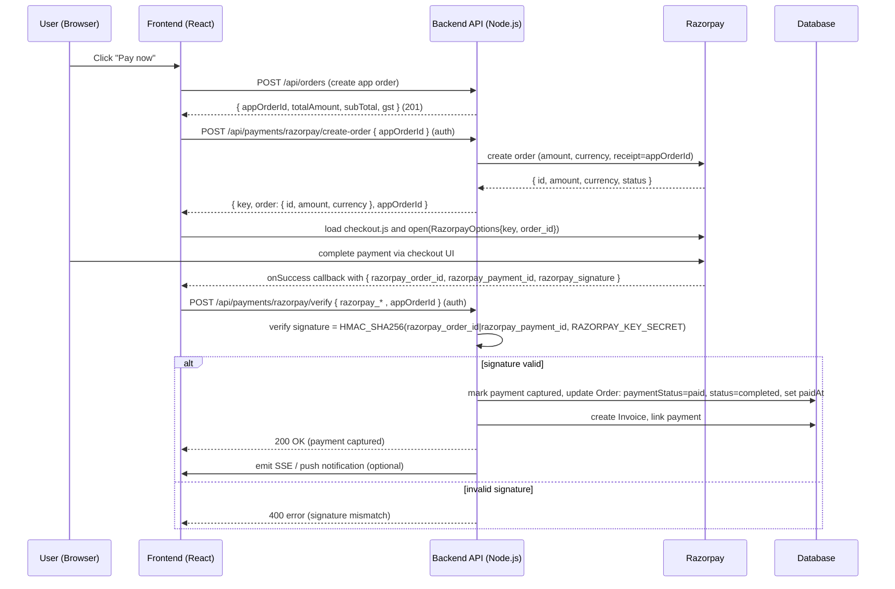
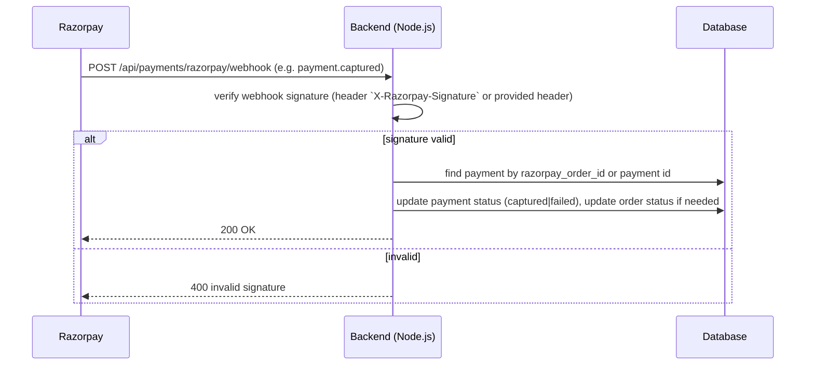

# Razorpay integration — end-to-end flow

This document explains the complete Razorpay checkout flow used by the storefront and the Node.js backend, including sequence diagrams (Mermaid), what each side calls, and how success/failure and webhooks are handled.

**Prerequisites**
- Backend env vars: `RAZORPAY_KEY_ID`, `RAZORPAY_KEY_SECRET` (must remain server-side).
- Server exposes authenticated endpoints:
  - `POST /api/payments/razorpay/create-order` — creates a Razorpay Order for an existing app order.
  - `POST /api/payments/razorpay/verify` — verifies client result (signature) and finalises payment.
  - (Optional) `POST /api/payments/razorpay/webhook` — webhook handler for async events.

**Important notes**
- Amounts passed to Razorpay are in the smallest currency unit (INR: paise). Multiply rupees by 100.
- Only the `key` (public) is returned to the frontend; the `secret` stays on the server.
- The server should map Razorpay order ids to your application `appOrderId` and ensure idempotent verification.

**High-level steps (summary)**
1. App creates an application order (POST `/api/orders`) — returns `appOrderId`, totals.
2. Frontend requests server to create a Razorpay order (POST `/api/payments/razorpay/create-order`) — server calls Razorpay API and returns `{ key, order, appOrderId }`.
3. Frontend loads Razorpay checkout script and opens Checkout with `key` and `order.id`.
4. User completes/attempts payment in Razorpay UI.
5. Razorpay calls the configured callbacks in the Checkout client (on success returns `razorpay_order_id`, `razorpay_payment_id`, `razorpay_signature`).
6. Frontend posts these values to server (POST `/api/payments/razorpay/verify` with `appOrderId`).
7. Server verifies `razorpay_signature` using `RAZORPAY_KEY_SECRET` (HMAC-SHA256). If valid, mark payment captured, set order `paymentStatus: paid` and `status: completed`, create invoice, emit events.
8. Server responds to frontend; frontend redirects to success page.

**Mermaid sequence diagram — frontend-driven checkout**



**Mermaid sequence diagram — webhook reconciliation (server receives async events)**



Security & verification details
- Client must never send `RAZORPAY_KEY_SECRET` to frontend.
- For the client-side callback verification flow, server must compute HMAC-SHA256 using the `razorpay_order_id` and `razorpay_payment_id` (and/or payload format suggested by Razorpay) and compare to `razorpay_signature` returned by the client.
- Example Node.js verification (pseudo):

```js
import crypto from 'crypto';

function verifySignature({ razorpay_order_id, razorpay_payment_id, razorpay_signature }) {
  const secret = process.env.RAZORPAY_KEY_SECRET;
  const payload = `${razorpay_order_id}|${razorpay_payment_id}`;
  const expected = crypto.createHmac('sha256', secret).update(payload).digest('hex');
  return expected === razorpay_signature;
}
```

Backend responsibilities
- Create a Razorpay Order via Razorpay's server-side API and store a record mapping `rzOrder.id` -> `appOrderId`.
- Return the `key` and `rzOrder` to the frontend (only `key` is public).
- Verify client-side payment signature with `verifyRazorpayPayment` endpoint and mark the order paid.
- Optionally handle Razorpay webhooks for `payment.captured`, `payment.failed`, and reconcile if the client-side verify was missed.
- Create invoice, emit SSE "recent-purchase" events, send emails or other post-payment work after confirmation.
- Ensure idempotency: if verification is called multiple times for same `appOrderId`, respond 200 when already captured.

Failure scenarios
- User aborts payment in the Razorpay UI: frontend receives an error/cancel callback; show appropriate UI and keep the order unpaid.
- Payment succeeded but signature verification fails: mark as suspicious and do NOT mark order paid; surface error to user and check webhooks or Razorpay dashboard to reconcile.
- Razorpay webhook indicates `payment.failed`: mark order as unpaid/failed and notify user.
- Network issues: frontend may not reach server after successful checkout; rely on webhooks to reconcile asynchronously.

Implementation checklist for the backend (Node.js)
- [ ] Add endpoint `POST /api/payments/razorpay/create-order`:
  - Input: `{ orderId }` (appOrderId)
  - Verify order exists and is unpaid; compute amount in paise and call Razorpay orders API.
  - Save mapping and return `{ key: RAZORPAY_KEY_ID, order: rzOrder, appOrderId }`.
- [ ] Add endpoint `POST /api/payments/razorpay/verify`:
  - Input: `{ razorpay_order_id, razorpay_payment_id, razorpay_signature, appOrderId }`.
  - Verify signature using `RAZORPAY_KEY_SECRET`.
  - If valid: update payment + order, create invoice, respond 200.
  - If invalid: respond 400 and log for reconciliation.
- [ ] Optional webhook endpoint `POST /api/payments/razorpay/webhook`: verify webhook signature and update DB.
- [ ] Emit SSE/recent-purchase events after payment confirmation.

Where to wire this in the existing frontend
- Current pages: update `/checkout/pay` to call `POST /api/payments/razorpay/create-order` and open Razorpay checkout with the returned `order.id` and `key` (already implemented in code changes).

Appendix — quick mapping of endpoints and payloads
- Frontend -> server: POST `/api/orders` => create app order
- Frontend -> server: POST `/api/payments/razorpay/create-order` { orderId } => returns `{ key, order, appOrderId }`
- Frontend -> server: POST `/api/payments/razorpay/verify` { razorpay_order_id, razorpay_payment_id, razorpay_signature, appOrderId }
- Razorpay -> server (webhook): POST `/api/payments/razorpay/webhook` (verify `X-Razorpay-Signature`)

If you'd like, I can:
- Add the server-side example implementations (Express + Razorpay SDK) for the two endpoints.
- Add example webhook verification code and unit tests.

File: [src/Documents/RazorpayFlow.md](src/Documents/RazorpayFlow.md)
